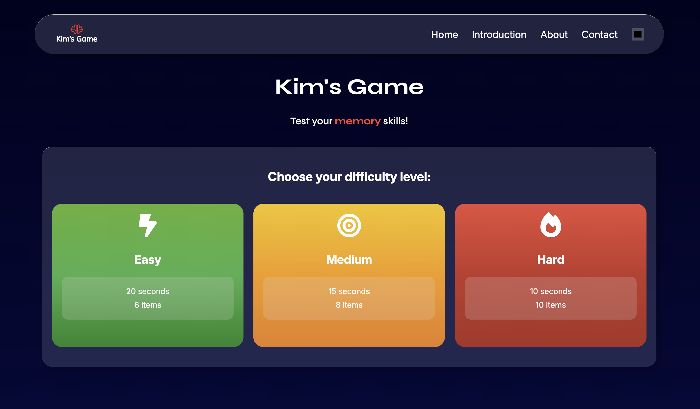
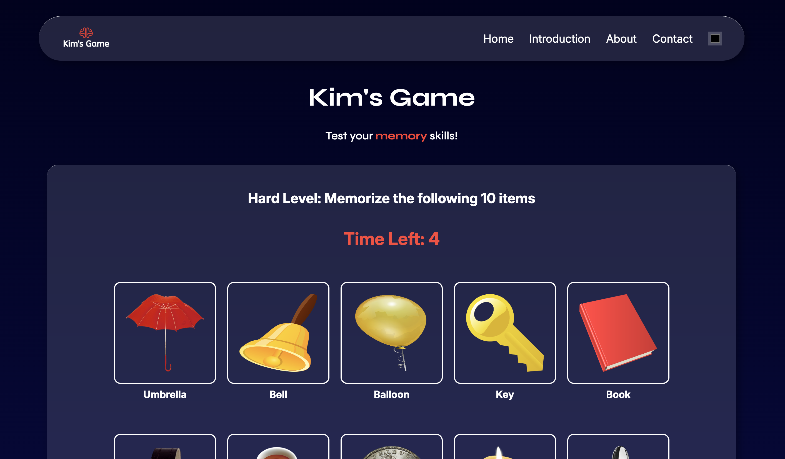

# Kim’s Game – Memory Training & Recall Challenge


A browser-based memory game where users are shown a set of items for a limited time and must recall them after they disappear.

---

## 🔥 Features

- Randomised item generation
- Multiple difficulty levels
- Countdown timer
- User input for recall
- Score tracking and best score system
- UI animations
- Sound effects and feedback

---

## 🛠️ Technologies Used

- HTML5
- CSS3
- JavaScript (Vanilla JS)
- Git & GitHub

---

## 🧠 How It Works

The game generates a random set of items stored in an array and displays them to the user for a limited time. After the countdown ends, the items are hidden and the user must recall them. The user’s input is then compared to the original array to calculate a score.

---

## ⚠️ Challenges Faced

- Managing game state between rounds
- Preventing duplicate items
- Resetting the timer and UI correctly
- Implementing randomised item generation while avoiding duplicates

---

## 📚 What I Learned

- Improved understanding of JavaScript arrays and logic
- Strengthened DOM manipulation skills
- Gained experience with iterative development
- Learned to use Git for version control

---

## 🔮 Future Improvements

- Convert the project into a full web/mobile application
- Add multiplayer functionality
- Expand game modes and features
- Add a leaderboard for players to compete with eachother
- Implement user authentication (sign up/log in page) to personalise gameplay

---

## 📌 Project Status

Completed as part of coursework, with a focus on building the game logic independently and applying iterative development principles.

---

## 📷 Screenshots

### Main Screen



### Gameplay



---

## 🚀 How to Run Locally

```bash
git clone https://github.com/seyar1382/Kim-s-Game.git
```

Open the project folder and run:

```bash
index.html
```

in your browser.

---

## 🔗 Live Demo / Repository

- GitHub: https://github.com/seyar1382/Kim-s-Game
- Live Site: https://seyar1382.github.io/Kim-s-Game/
